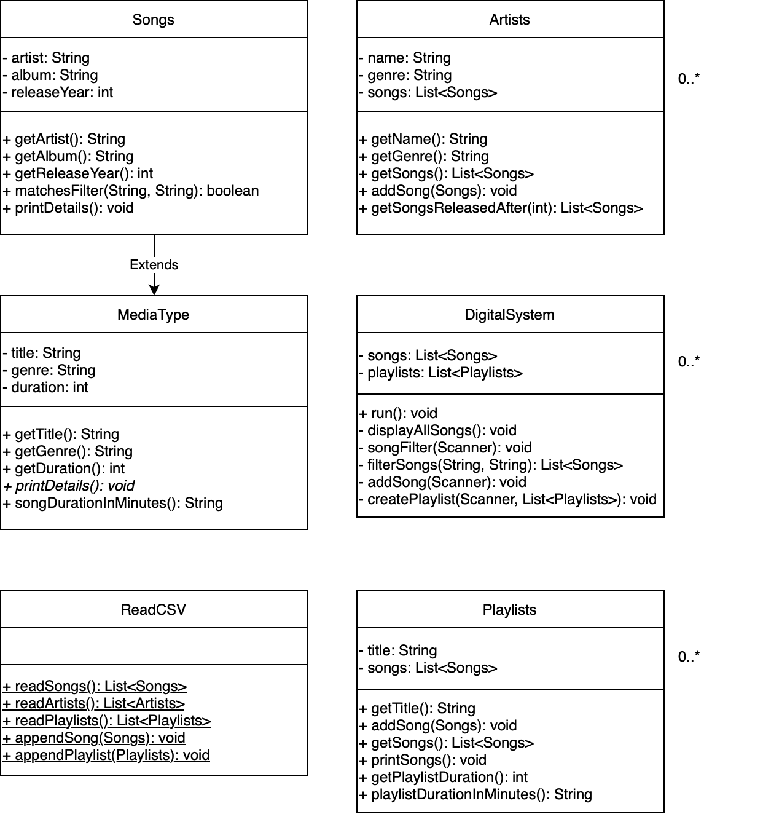

## System Description
The digital music manager system is a realistic Java-based system that incorporates object-oriented programming (OOP). More specifically, it implemepnts encapsulation, aggregation, and inheritance principles.
    
The system allows users to view their songs, as well as the song's artists, albums, release year, duration, and genre. Additonally, users have the option to interact with the system by adding songs to their collection, filtering their songs by genre and/or artist, creating playlists and adding songs to their playlists.

## UML Class Diagram
Attached below is the UML class diagram of my system:
